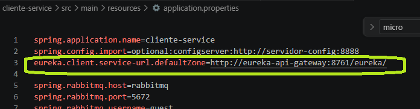
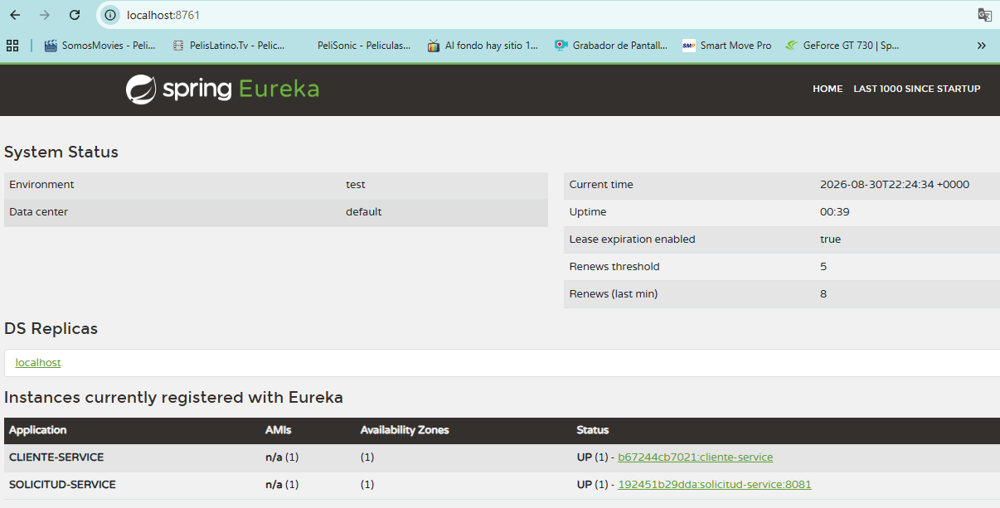
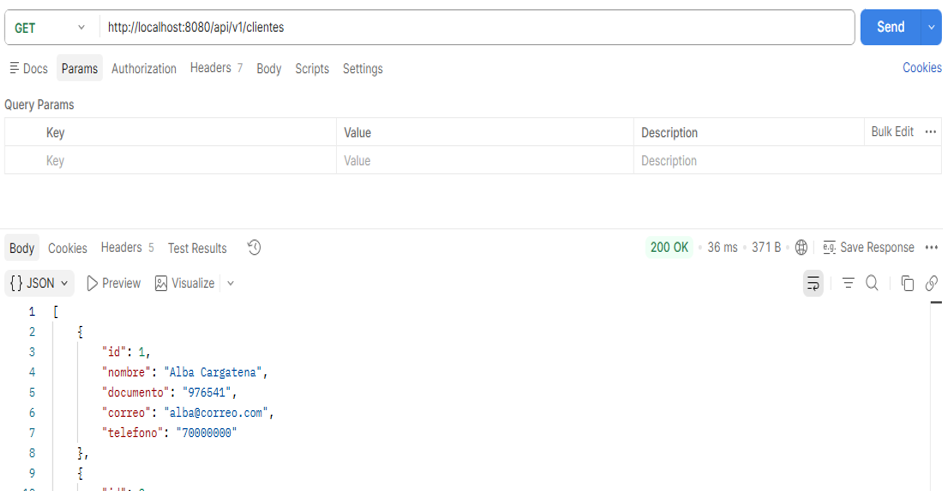
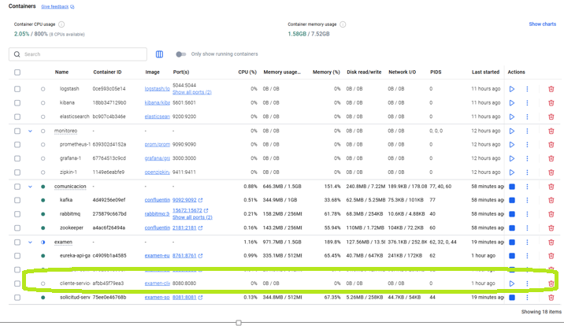
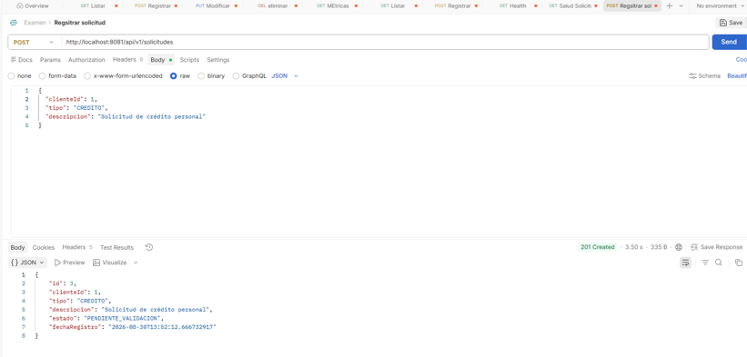
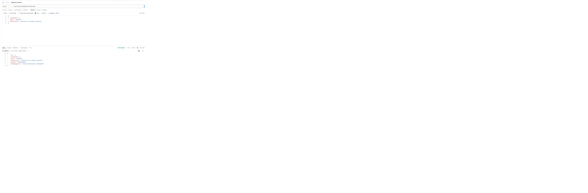
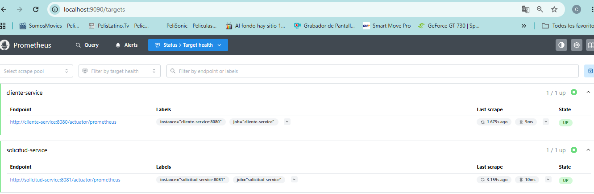
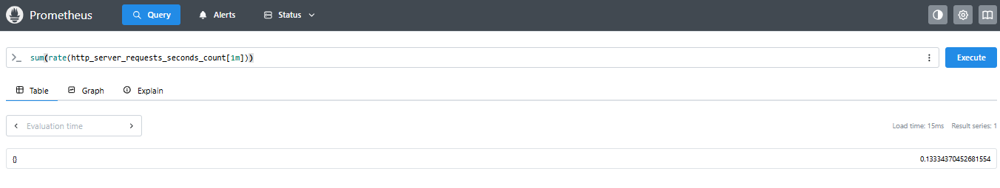
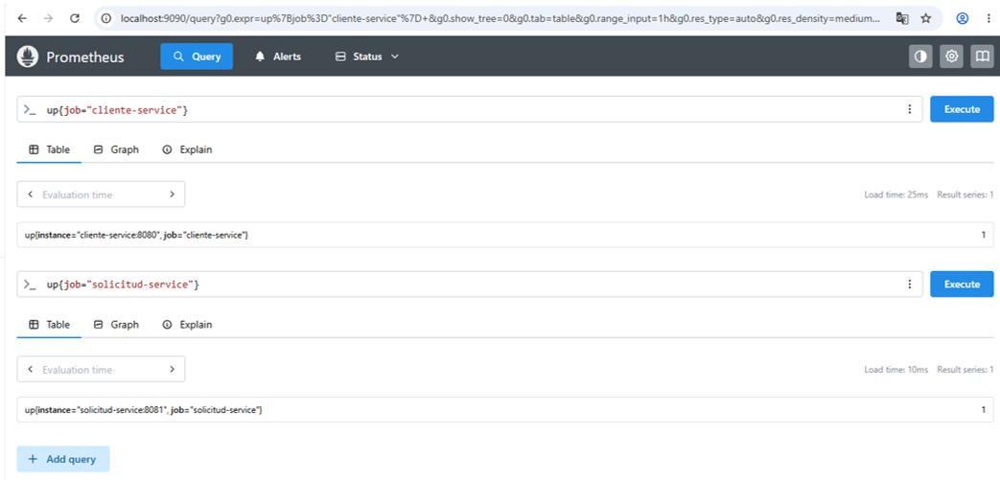

# Examen Final - Monitoreo, Observabilidad y DevSecOps

## 1. Descripción del proyecto

El proyecto implementa una arquitectura de microservicios orientada a la gestión de clientes y solicitudes.

Los microservicios principales son:

- cliente-service
- solicitud-service

La solución incorpora componentes de descubrimiento de servicios, configuración centralizada, mensajería, resiliencia y observabilidad.

---

## 2. Arquitectura implementada

Componentes utilizados:

- Spring Boot
- Eureka Server
- Spring Cloud Config Server
- OpenFeign
- Resilience4j
- RabbitMQ
- Apache Kafka
- Prometheus
- Grafana
- Docker
- Docker Compose

Microservicios:

### cliente-service

Puerto externo:

8080

Responsabilidad:

Gestionar información de clientes.

### solicitud-service

Puerto externo:

8081

Responsabilidad:

Registrar solicitudes asociadas a clientes y validar la existencia del cliente mediante comunicación entre microservicios.

---

## 3. Comunicación entre microservicios

solicitud-service se comunica con cliente-service mediante OpenFeign.

URL interna Docker:

http://cliente-service:8080

El servicio valida la existencia del cliente antes de registrar una solicitud.

---

## 4. Service Discovery - Eureka

Se implementó Eureka para registrar y descubrir los microservicios.

Puerto:

8761

URL:

http://localhost:8761

Servicios registrados:

- CLIENTE-SERVICE
- SOLICITUD-SERVICE

Evidencia:

Configuración de Eureka
	
	
	
Dahsboard Eureka
	
---

## 5. Configuración centralizada

Se utiliza Spring Cloud Config Server.

Puerto:

8888

URL:

http://localhost:8888

Los microservicios pueden obtener configuración desde el servidor de configuración.

---

## 6. Resiliencia - Circuit Breaker

Se implementó Circuit Breaker con Resiliencia en solicitud-service.

Caso probado:

1. cliente-service disponible.
2. Se registra una solicitud normalmente.
3. cliente-service se detiene.
4. solicitud-service utiliza el fallback.
5. La solicitud queda con estado PENDIENTE_VALIDACION.
6. cliente-service vuelve a estar disponible.
7. El mecanismo de recuperación procesa la solicitud.
8. La solicitud cambia a REGISTRADA.

Esto permite demostrar tolerancia a fallos y recuperación automática.

Evidencia:

	Servicio cliente-service disponible
	8
	
	
	Se da de baja el servicio
	

	Se registra solicitud como PENDIENTE_VALIDACION
	
	
	Al levantar el servicio se cambia a REGISTRADA
	
---

## 7. Mensajería

### RabbitMQ

RabbitMQ se utiliza para comunicación mediante colas.

Puertos:

5672
15672

Contenedor:

rabbitmq

Estado validado:

UP

### Kafka

Kafka se utiliza para procesamiento de eventos.

Puerto:

9092

Contenedor:

kafka

Grupo utilizado:

cliente-group

Topic utilizado:

solicitud-event

Se verificó que cliente-service se conecta correctamente mediante:

kafka:9092

---

## 8. Health Checks

Los microservicios exponen Spring Boot Actuator.

### cliente-service

http://localhost:8080/actuator/health

Resultado:

{"status":"UP"}

### solicitud-service

http://localhost:8081/actuator/health

Resultado:

status UP

También se verificó:

- Config Server
- H2
- Eureka
- RabbitMQ
- Discovery Client

---

## 9. Métricas con Prometheus

Los dos microservicios exponen métricas mediante:

### cliente-service

http://localhost:8080/actuator/prometheus

### solicitud-service

http://localhost:8081/actuator/prometheus

Prometheus se configuró con los siguientes targets:

cliente-service:8080

solicitud-service:8081

Ambos targets fueron verificados en Prometheus con estado:

UP

Ejemplos de métricas disponibles:

- jvm_memory_used_bytes
- disk_free_bytes
- http_server_requests_seconds_count
- application_started_time_seconds

Evidencia:

Prometheus > Targets

mostrando:

cliente-service = UP

solicitud-service = UP

	

Métricas
	
	
	
	
---

## 10. Grafana

Grafana está desplegado mediante Docker.

Puerto:

3000

Contenedor:

monitoreo-grafana-1

Estado actual:

El contenedor se encuentra levantado, pero queda pendiente completar la validación del acceso a la interfaz y la creación del dashboard.

Pendiente:

- configurar Prometheus como Data Source
- crear dashboard
- visualizar métricas
- generar evidencia

---

## 11. Contenedores Docker

La solución utiliza Docker Compose para ejecutar los diferentes componentes.

Entre los contenedores utilizados se encuentran:

- cliente-service
- solicitud-service
- eureka-api-gateway
- servidor-config
- rabbitmq
- kafka
- zookeeper
- prometheus
- grafana

Para verificar:

docker ps

---

## 12. Ejecución

Compilar:

mvn clean install -DskipTests

Levantar los microservicios:

docker compose up -d --build

Verificar:

docker ps

Health:

curl http://localhost:8080/actuator/health

curl http://localhost:8081/actuator/health